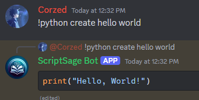

# Script Sage AI 🤖

Script Sage AI is a powerful Discord bot designed to help you generate code for various programming languages directly within your Discord server. It uses OpenAI's API to provide intelligent answers, including generating Java, Python, HTML, and more.

## Features ✨
- **Java, Python, HTML, Skript, Command Block coding**: Ask Script Sage AI to generate or explain code snippets.
- **Superhero Configuration for Minecraft**: Generate superhero config files for the Minecraft superheroes plugin.
- **Usage limits**: Regular users get daily usage limits.

## Demo Screenshot 📸
  
_Example of Script Sage AI responding to a Python question._

## Installation 📥

### Prerequisites
- **Node.js** (v16.x or higher) and **npm**
- **Discord bot token** from the [Discord Developer Portal](https://discord.com/developers/applications)
- **OpenAI API key** from [OpenAI](https://platform.openai.com/signup)

### Steps to install:

1. **Clone the repository**:
   ```bash
   git clone https://github.com/yourusername/scriptsage-ai.git
   cd scriptsage-ai
   ```

2. **Install dependencies**:
   ```bash
   npm install
   ```

3. **Set up environment variables**:  
   Create a `.env` file in the root directory and add the following:
   ```bash
   DISCORD_TOKEN=your_discord_bot_token
   OPENAI_API_KEY=your_openai_api_key
   ```

4. **Create OpenAI Assistants**:  
   Before using the bot, you need to create OpenAI assistants for each coding language. Visit the [OpenAI Assistant Creation](https://platform.openai.com/docs/guides/assistants) page to set up assistants and get their respective assistant IDs. Once created, replace the placeholder assistant IDs in the code with the actual ones:
   ```javascript
   const assistants = {
     java: async (question) => useAssistant("your_openai_assistant_id", question),
     skript: async (question) => useAssistant("your_openai_assistant_id", question),
     commandblock: async (question) => useAssistant("your_openai_assistant_id", question),
     superhero: async (question) => useAssistant("your_openai_assistant_id", question),
     html: async (question) => useAssistant("your_openai_assistant_id", question),
     python: async (question) => useAssistant("your_openai_assistant_id", question),
   };
   ```

5. **Start the bot**:
   ```bash
   npm start
   ```

## Usage 🚀

Once the bot is added to your server and running, use the following commands to interact with it:

- `!java <question>`: Ask a Java-related coding question.
- `!python <question>`: Ask a Python-related coding question.
- `!html <question>`: Ask an HTML-related coding question.
- `!skript <question>`: Ask a Minecraft Skript-related question.
- `!commandblock <question>`: Ask a Minecraft Command Block-related question.
- `!superhero <question>`: Generate config files for the Minecraft superheroes plugin.
- `!usage`: Check your current usage stats.
- `!createchannel`: Create a private channel.
- `!help`: Display all available commands.

## Contributing 🛠️
Contributions are welcome! Please follow these steps:

1. Fork the repository.
2. Create a new branch for your feature or bugfix.
3. Submit a pull request with a detailed description of your changes.

## License 📄
This project is licensed under the GNU General Public License v3.0. See the [LICENSE](LICENSE) file for details.

## Support 💬
If you encounter any issues or need help, feel free to open an issue in the repository or contact us on Discord. https://discord.gg/WQwPYwvH7Y

---

_Enjoy coding with Script Sage AI!_
